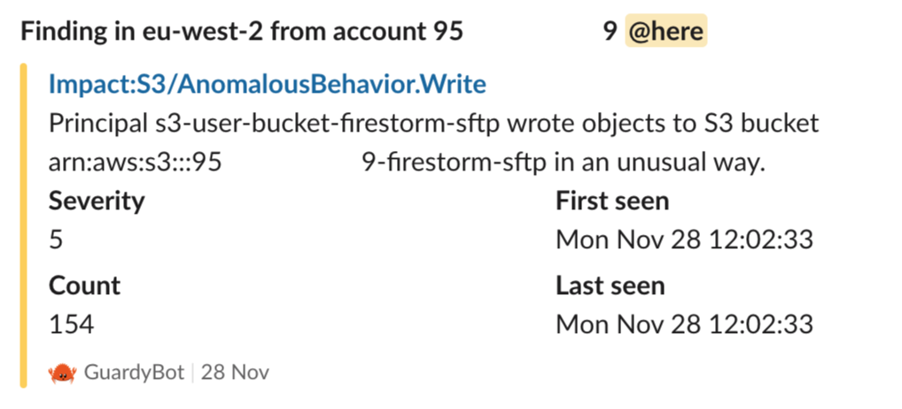

# GuardDuty to Slack lambda

Designed to run as a Lambda which is invoked by an SNS subscription. It is tuned to listen specifically to GuardDuty findings and forward them to Slack. Strict de-serialization means any unexpected message will throw an error.

Typically deployed with the Terraform as GD detectors need to run in every region (this lambda can live in one region, triggered by a single SNS topic)

## Screenshot



## Setup to run locally

- Create a `.env` file in the root with a `WEBHOOK_URL` to a test Slack channel
- Optionally set `RUST_LOG` to something like `debug`
- Compile a `musl` version of OpenSSL so you can compile for the right target 😓
  
Because the Amazon Linux 2 runtime is musl linux (instead of gnu) we have to cross compile if running from Ubuntu. There are compile-in-container solutions for Rust that work quite well... for everything except OpenSSL.

Luckily someone has written up the exact set of instructions you need to get openssl to compile: [https://qiita.com/liubin/items/6c94f0b61f746c08b74c](https://qiita.com/liubin/items/6c94f0b61f746c08b74c)

And in case that link ever goes down:

```sh
ln -s /usr/include/x86_64-linux-gnu/asm /usr/include/x86_64-linux-musl/asm &&     ln -s /usr/include/asm-generic /usr/include/x86_64-linux-musl/asm-generic &&     ln -s /usr/include/linux /usr/include/x86_64-linux-musl/linux

mkdir /musl

wget https://github.com/openssl/openssl/archive/OpenSSL_1_1_1f.tar.gz
tar zxvf OpenSSL_1_1_1f.tar.gz 
cd openssl-OpenSSL_1_1_1f/

CC="musl-gcc -fPIE -pie" ./Configure no-shared no-async --prefix=/musl --openssldir=/musl/ssl linux-x86_64
make depend
make -j$(nproc)
make install
```

We then set (in `scripts/build.sh`) three environment variables to give `pkg-config` the required clues:

```sh
export PKG_CONFIG_ALLOW_CROSS=1
export OPENSSL_STATIC=true
export OPENSSL_DIR=/musl
```

## Building and running locally

This runs in a docker container which emulates the Lambda runtime environment. It expects a JSON payload (representing an SNS message) to be passed to it. A Makefile sets up the required commands.

- **make build** - Runs a release build against the `x86_64-unknown-linux-musl` for Lambda. (Debug builds are really big, sometimes too big for Lambda)
- **make run** - Runs the latest binary in the Docker lambda emulator. Won't automatically rebuild so might not reflect all your src changes! Runs a random payload from `examples/` directory each time.
- **make all** or **make** - Build then run. You can use this most of the time in place of run, its only 0.05s slower if there is nothing to build.
- **make release** - Builds the latest version and zips it up ready for Terraform/uploading. Should appear in the repo root as `guarddutyslack.zip`.
- **make test** - Runs the comprehensive unit test suite.

### Generating more example messages

These were made by creating a lambda to dump all received events to CloudWatch, and then telling GuardDuty to generate all sample findings.

## Docs to used modules

- [slack-hook3 GitHub](https://github.com/0xc0deface/rust-slack/tree/v3)
- [slack-hook3 docs.rs](https://docs.rs/slack-hook3/latest/slack_hook3/)
- [aws_lambda_events](https://github.com/LegNeato/aws-lambda-events) - structs for SNS messages and others
- [aws-rust-lambda-runtime](https://github.com/awslabs/aws-lambda-rust-runtime)
- [Original AWS Rust blogpost](https://aws.amazon.com/blogs/opensource/rust-runtime-for-aws-lambda/) - hopelessly out of date! The runtime changed to async in v0.3
